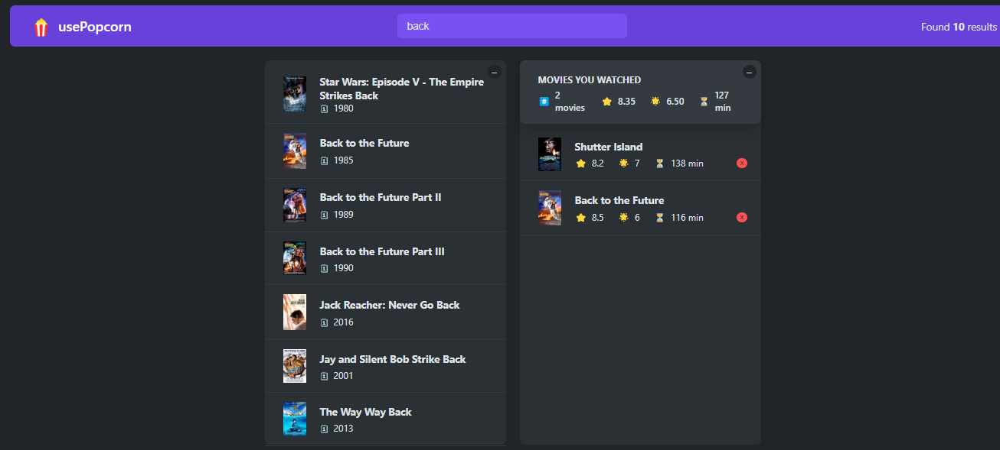

# Movie App

A nice movie application where you can search movies, make a watched list and many other things.

## Table of contents

- [Overview](#overview)
  - [The app](#the-app)
  - [Screenshot](#screenshot)
  - [Built with](#built-with)
  - [Used Features](#used-features)
- [Author](#author)

## Overview

### The app

Users should be able to:

- View the optimal layout depending on their device's screen size
- Initially, they can search for the movie they want from a real API
- They can examine the detailed information of the mov'e they want from the movies returned from the API.
- They have the ability to add and remove movies from the watched list.
- They can give a rating to the movies they have watched
- They have the ability to control UI with some keys.

### Screenshot

### Built with

- React.JS
- CSS custom properties

### Used Features
- useState
- useEffect
- useRef
- REST API
- custom hooks

## Author

- Website - [Damla Kara](https://www.linkedin.com/in/damla-kara-348081232/)